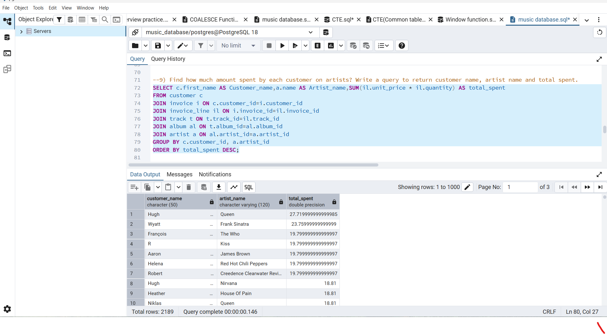
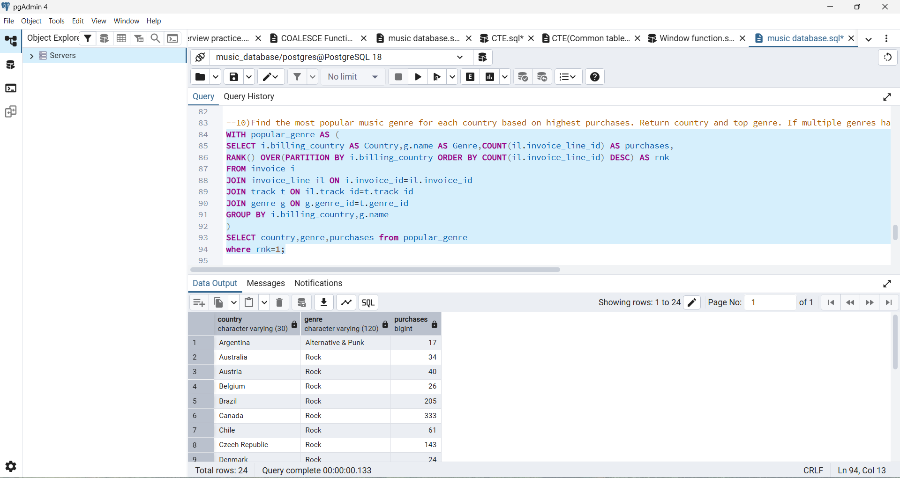
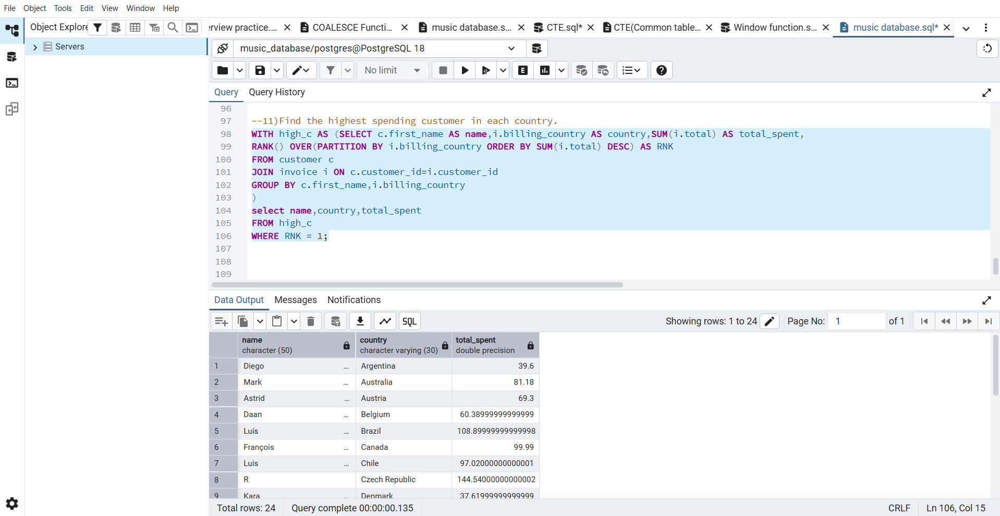

# 🎵 Music Store SQL Project

## 📌 Project Description

This project is based on a Music Store Database.
The goal of this project is to analyze the database using SQL queries and solve different business problems.

In this project I used SQL concepts like joins, group by, subqueries, CTE, and window functions to get useful insights from the data.

---

## 🚀 Skills Used

* SQL
* Joins
* Group By
* Aggregate Functions
* Subqueries
* Common Table Expressions (CTE)
* Window Functions
* Data Analysis

---

## 🗂️ Database Tables

The database contains the following tables:

* album
* artist
* customer
* employee
* genre
* invoice
* invoice_line
* media_type
* playlist
* playlist_track
* track

---

## ❓ Business Questions Solved

1. Who is the senior most employee based on job title?
2. Which country has the most invoices?
3. Who is the best customer?
4. What is the most popular genre?
5. Top 5 customers by total spending
6. Best selling artist
7. Customer who spent the most money
8. Most purchased track
9. Revenue generated by each country
10. Top employees by sales

---

## 🧠 Advanced SQL Used

* CTE (Common Table Expression)
* Window Functions (ROW_NUMBER, RANK)
* Subqueries
* Multiple Joins
* Aggregate Queries

---

## 🛠️ Tools Used

* MySQL / SQLite
* DB Browser
* GitHub

---

## 📊 ER Diagram

This is the database structure of the Music Store project.

---

## 📸 Screenshots

## Screenshots

---

## ✅ Project Purpose

This project was created for practice and to demonstrate SQL skills for resume and interview preparation.

This project shows my ability to work with databases, write complex queries, and solve real-world business problems using SQL.
